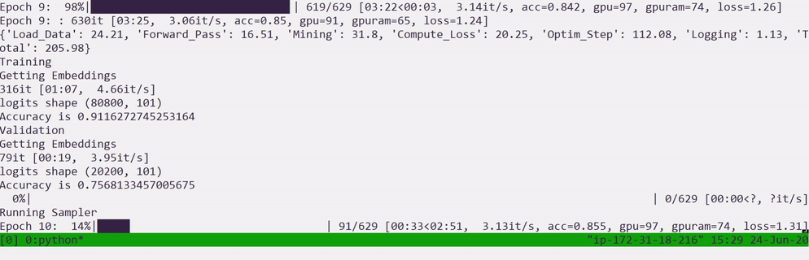

# Deep Metric Learning

This repository contains code for my MSc Thesis and work at VisioLab. It focuses on the development of a deep metric learning model for incremental learning in the classification regime. For a deep overview of the theory and design decisions behind the architecture refer to my MSc thesis which will be added to the repository.



## Three Stage Architecture


## How to Run Basics

Due to relative imports, and the general directory design, this model is currently only meant to be used through `main.py`.  The simplest way to start is to import the architecture, instantiate it and then run train with your preferred hyperparameters on your dataset.

Here is a full example: [Clean Food Transfer Learning Example](https://github.com/VisioLab/deep-metric-learning/blob/master/Fine-Tuning Example.ipynb) |[](https://colab.research.google.com/gist/alexisdrakopoulos/be0ce2fb2cabb182387a81840202da26/fine-tuning-example.ipynb)

However a simpler example for training from scratch and fine tuning would be

```python
from model.model import ThreeStageNetwork

# ============ Initial Training ===========
# build the model
model = ThreeStageNetwork(trunk_optim="SGD",
                          embedder_optim="SGD",
                          classifier_optim="SGD",
                          trunk_lr=1e-3,
                          embedder_lr=1e-3,
                          classifier_lr=1e-3)
# model.load_weights("models/models.h5")
model.setup_data(dataset=FoodData,
                 h5_path=training_data_path,
                 batch_size=128,
                 load_indices=False,
                 indices_path="logs/data_indices.npz")
model.train(n_epochs=10,
            loss_ratios=[0,0,0,1])

# ============ Fine Tuning ===========
# first instantiate the network, we choose 10 classes
# and set out optimizers to SGD with LRs 1E-5, 1E-4, 1E-3 respectively.
model = ThreeStageNetwork(num_classes=10,
                          trunk_optim="SGD",
                          embedder_optim="SGD",
                          classifier_optim="SGD",
                          trunk_lr=1e-5,
                          embedder_lr=1e-4,
                          classifier_lr=1e-3,
                          log_train=False)

# Now we load the pretrained weights, of course don't load the classifier
model.load_weights("example/models.h5", load_classifier=False)

# We pass our data class, choose a batch size of 64 and load the indices
# from our indices path. We also pass the associated label array.
# We choose M (images per class per epoch) to be 4.
model.setup_data(dataset=NewData,
                 batch_size=64,
                 load_indices=True,
                 num_workers=0,
                 M=4,
                 repeat_indices=10,
                 labels = labels,
                 indices_path="example/datasets/5_class_0.npz")

# now we begin training for 10 epochs with loss ratios 1,1,1,3 signifying the
# metric loss combination of triplet + MS + Proxy Anchor + crossentropy.
model.train(n_epochs=10,
            loss_ratios=[1,1,1,3],
            model_save_path="example",
            model_name="finetuned_0.1.h5")
```

In the first case we first instantiate the network architecture with the default values. We then setup our data by providing the path to our training data file and the batch size to use. This will prepare our dataloaders, select the indices to train, validate and holdout on. Finally we call the train method with the number of epochs and the loss ratios to pass onto our four loss functions.

When training is finished the model will automatically be saved and the entire log files will be zipped up.

## Configuration, Dependencies and Directory Structure

### Dependencies

This is a list of the non-common dependencies used in the project, a full list will be provided in requirements.txt:

* The core dependencies are the [pytorch-metric-learning](https://github.com/KevinMusgrave/pytorch-metric-learning) library by Kevin from which we utilize the pair based losses and the MS miner. 
* We also use [efficientnet_pytorch](https://github.com/lukemelas/EfficientNet-PyTorch) for the pretrained EfficientNet weights.
*  [UMAP](https://umap-learn.readthedocs.io/en/latest/) is used for visualization purposes.
* [tqdm](https://github.com/tqdm/tqdm) is used for loading bars
* [pynvml](https://pypi.org/project/pynvml/) is used for GPU monitoring

### Directory Structure

```
> data
	> data
		> # training files
	> autoaugment.py
	> hdf5_loader.py
> images
> model
	> losses.py
	> model.py
	> utils.py
README.md
```

 `data` contains the augmentation policy and everything we need to construct the datasets and dataloaders from our hdf5 dataset. `model` contains the actual architecture and loss func implementations as well as some utilities for directory management and S3 uploads/downloads.
